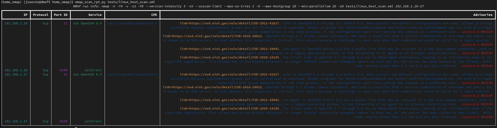

# Enhancing Nmap with Python

Very few pieces of Open Source software generate [so much hype](https://nmap.org/movies/) than [Nmap](https://nmap.org/); it is one of those tools that packs so many useful features that it can help you to make your systems more secure by just running it with a few flags.

> Nmap ("Network Mapper") is a free and open source (license) utility for network discovery and security auditing. Many systems and network administrators also find it useful for tasks such as network inventory, managing service upgrade schedules, and monitoring host or service uptime.

It can also be used to bypass weak protections, to find hidden or mis-configured services or just to give you a better understanding how networks works.

## What you will learn from this article

We will cover the following to illustrate how you can enhance Nmap with Python:

* Write a small scripts that can scan all the hosts on the local network, making sure it runs with the proper privileges.
* Enhance Nmap by correlating services with security advisories.
* Convert our scripts into a webservice. Will add basic security.

## Things you should know and do before starting

Don't worry too much, I will guide you through the steps so this will be a fun experience and also the source code is documented:

* Familiar with basic network concepts like [Classless inter-domain routing (CIDR)](https://en.wikipedia.org/wiki/Classless_Inter-Domain_Routing)
* Able to write a program in a scripting language like [Python](https://www.python.org/). I used Python 3.9 here.
* A computer running Linux. I used Fedora 35.
* The code from can be installed using a virtual environment. If you are not familiar with a virtual environment, you can read the following: [Packaging applications to install on other machines with Python](https://www.redhat.com/sysadmin/packaging-applications-python).
* Install the whole code from this tutorial by following the instructions as explained on the main [README document](http://README.md) file

Last two things:
* I skipped __some__ imports in the code snippets as they do not enhance the code demonstrations. To get the most accurate code, please do clone the public git repository for this tutorial and open the source code.
* _Only run this examples against your local network_. You can be curious, have fun and learn new things about existing tools without affecting others.

Hacking is about learning!

# Nmap 101: Identify all the public services in our network

We do not care about being 'stealth' or triggering an [Intrusion Detection System (IDS)](https://en.wikipedia.org/wiki/Intrusion_detection_system) like [Suricata](https://suricata.io/) because our *port scanning activity*; The goal is to see what services are running in our network using a command line interface (CLI) script.

Nmap requires elevated privileges to do the OS fingerprinting and scans using raw sockets. You will need to run the commands as root or [su "do" (SUDO)](https://www.sudo.ws/) to elevate your permissions. A SUDO rule to do this is similar to this (file /etc/sudoers):

```shell=
## Same thing without a password
%wheel	ALL=(ALL)	NOPASSWD: ALL
```
This means that anyone on the 'wheel' unix group can run commands as root:

```shell=
(2600) [josevnz@dmaf5 2600]$ grep wheel /etc/group
wheel:x:10:josevnz,services

# To confirm we can run commands as root
(2600) [josevnz@dmaf5 2600]$ sudo -l
Matching Defaults entries for josevnz on dmaf5:
    !visiblepw, always_set_home, match_group_by_gid, always_query_group_plugin, env_reset, env_keep="COLORS DISPLAY HOSTNAME HISTSIZE KDEDIR LS_COLORS",
    env_keep+="MAIL QTDIR USERNAME LANG LC_ADDRESS LC_CTYPE", env_keep+="LC_COLLATE LC_IDENTIFICATION LC_MEASUREMENT LC_MESSAGES", env_keep+="LC_MONETARY
    LC_NAME LC_NUMERIC LC_PAPER LC_TELEPHONE", env_keep+="LC_TIME LC_ALL LANGUAGE LINGUAS _XKB_CHARSET XAUTHORITY",
    secure_path=/usr/local/sbin\:/usr/local/bin\:/usr/sbin\:/usr/bin\:/sbin\:/bin\:/var/lib/snapd/snap/bin

User josevnz may run the following commands on dmaf5:
    (ALL) NOPASSWD: ALL
```

Next will do a quick scan of our local network (in this example is 192.168.1.0/24); I used the _-v (verbose)_ flag to get some progress feedback while scanning for all the ports while also doing OS fingerprinting (-O). I saved the execution of the Nmap run to an XML file (-oX), which Nmap can use to resume execution if it gets interrupted (--resume):

```shell=
# In case the scan is interrupted: nmap --resume $HOME/home_scan.xml
[josevnz@dmaf5 docs]$ sudo nmap -v -n -p- -sT -sV -O --osscan-limit --max-os-tries 1 -oX $HOME/home_scan.xml 192.168.1.0/24
Starting Nmap 7.80 ( https://nmap.org ) at 2021-12-30 16:35 EST
NSE: Loaded 45 scripts for scanning.
Initiating ARP Ping Scan at 16:35
Scanning 254 hosts [1 port/host]
...
# After a while and a several cups of Venezuelan coffee...
Network Distance: 1 hop
TCP Sequence Prediction: Difficulty=265 (Good luck!)
IP ID Sequence Generation: All zeros

Nmap scan report for 192.168.1.20
Host is up (0.0097s latency).
Not shown: 65530 closed ports
PORT      STATE    SERVICE      VERSION
36184/tcp filtered unknown
37309/tcp filtered unknown
49323/tcp open     unknown
49376/tcp filtered unknown
62078/tcp open     iphone-sync?
MAC Address: 9E:90:75:3A:D7:XX (Unknown)
...
```

The resulting [XML format file](https://nmap.org/book/output-formats-xml-output.html) is very verbose:

```xml=
<host starttime="1640901327" endtime="1640902555"><status state="up" reason="arp-response" reason_ttl="0"/>
<address addr="192.168.1.1" addrtype="ipv4"/>
<address addr="38:5B:5E:1D:52:99" addrtype="mac"/>
<hostnames>
</hostnames>
<ports><extraports state="closed" count="65523">
<extrareasons reason="conn-refused" count="65523"/>
</extraports>
<port protocol="tcp" portid="139"><state state="open" reason="syn-ack" reason_ttl="0"/><service name="netbios-ssn" product="Samba smbd" version="3.X - 4.X" extrainfo="workgroup: ZZZ" method="probed" conf="10"><cpe>cpe:/a:samba:samba</cpe></service></port>
    ...
```

Time to do some coding; Parsing data in many formats is one of the Python language strengths, data is extracted and normalized for all the ports that are not 'closed' using [lxml](https://github.com/lxml/lxml):

```python=
class OutputParser:
    """
    Parse Nmap raw XML output
    """

    @staticmethod
    def parse_nmap_xml(xml: str) -> (str, Any):
        """
        Parse XML and return details for the scanned ports
        @param xml:
        @return: tuple nmaps arguments, port details
        """
        parsed_data = []
        root = ElementTree.fromstring(xml)
        nmap_args = root.attrib['args']
        for host in root.findall('host'):
            for address in host.findall('address'):
                curr_address = address.attrib['addr']
                data = {
                    'address': curr_address,
                    'ports': []
                }
                states = host.findall('ports/port/state')
                ports = host.findall('ports/port')
                for i in range(len(ports)):
                    if states[i].attrib['state'] == 'closed':
                        continue  # Skip closed ports
                    port_id = ports[i].attrib['portid']
                    protocol = ports[i].attrib['protocol']
                    services = ports[i].findall('service')
                    cpe_list = []
                    service_name = ""
                    service_product = ""
                    service_version = ""
                    for service in services:
                        for key in ['name', 'product', 'version']:
                            if key in service.attrib:
                                if key == 'name':
                                    service_name = service.attrib['name']
                                elif key == 'product':
                                    service_product = service.attrib['product']
                                elif key == 'version':
                                    service_version = service.attrib['version']
                        cpes = service.findall('cpe')
                        for cpe in cpes:
                            cpe_list.append(cpe.text)
                        data['ports'].append({
                            'port_id': port_id,
                            'protocol': protocol,
                            'service_name': service_name,
                            'service_product': service_product,
                            'service_version': service_version,
                            'cpes': cpe_list
                        })
                        parsed_data.append(data)
        return nmap_args, parsed_data
```

Once the data is collected we can create a nice table in the terminal with the help of [Rich](https://github.com/Textualize/rich).
The table has the following columns:
* Internet Protocol (IP) address
* Protocol: On this script will be always Transfer Control Protocol (TCP)
* Port ID: The port number where the service runs
* Service: An networked service like Secure Shell (SSH)
* Common Platform Enumeration ([CPE](https://nvd.nist.gov/products/cpe)): Is a structured naming scheme for information technology systems, software, and packages.
* Advisories: Any vulnerability related to the CPE identified by Nmap. Will need to correlate those ourselves.

```python=
def create_scan_table(*, cli: str) -> Table:
    """
    Create a table for the CLI UI
    :param cli: Full Nmap arguments used on the run
    :return: Skeleton table, no data
    """
    nmap_table = Table(title=f"NMAP run info: {cli}")
    nmap_table.add_column("IP", justify="right", style="cyan", no_wrap=True)
    nmap_table.add_column("Protocol", justify="right", style="cyan", no_wrap=True)
    nmap_table.add_column("Port ID", justify="right", style="magenta", no_wrap=True)
    nmap_table.add_column("Service", justify="right", style="green")
    nmap_table.add_column("CPE", justify="right", style="blue")
    nmap_table.add_column("Advisories", justify="right", style="blue")
    return nmap_table
...
def fill_simple_table(*, exec_data: str, parsed_xml: Dict[Any, Any]) -> Table:
    """
    Convenience method to create a simple UI table with Nmap XML output
    :param exec_data: Arguments and options used to run Nmap
    :param parsed_xml: Nmap data as a dictionary
    :return: Populated tabled
    """
    nmap_table = create_scan_table(cli=exec_data)
    for row_data in parsed_xml:
        address = row_data['address']
        ports = row_data['ports']
        for port_data in ports:
            nmap_table.add_row(
                address,
                port_data['protocol'],
                port_data['port_id'],
                f"{port_data['service_name']} {port_data['service_product']} {port_data['service_version']}",
                "\n".join(port_data['cpes']),
                ""
            )
    return nmap_table
```

The resulting script uses the code above to give the user the whole picture about the local network scan:

```python=
#!/usr/bin/env python
import sys
from rich.console import Console
from home_nmap.query import OutputParser
from home_nmap.ui import fill_simple_table

if __name__ == "__main__":
    console = Console()
    for nmap_xml in sys.argv[1:]:
        with open(nmap_xml, 'r') as xml:
            xml_data = xml.read()
            rundata, parsed = OutputParser.parse_nmap_xml(xml_data)
            nmap_table = fill_simple_table(exec_data=rundata, parsed_xml=parsed)
            console.print(nmap_table)
```


If you notice, the 'Advisories' column is left completely empty. Will use the [NIST cybersecurity website search engine](https://www.nist.gov/cybersecurity) to populate the missing advisories, by passing the CPE that have _version information_ to avoid false positives.

We use [requests](https://github.com/psf/requests) to help us with the HTTP communication:

```python
from dataclasses import dataclass
import requests
IGNORED_CPES = {"cpe:/o:linux:linux_kernel"}
from cpe import CPE
from lxml import html

@dataclass
class NIDS:
    summary: str
    link: str
    score: str

class NDISHtml:

    def __init__(self):
        """
        Some CPE return too many false positives,
        so they are ignored right out the bat
        """
        self.raw_html = None
        self.parsed_results = []
        self.url = "https://nvd.nist.gov/vuln/search/results"
        self.ignored_cpes = IGNORED_CPES

    def get(self, cpe: str) -> str:
        """
        Run a CPE search on the NDIS website. If the CPE has no version then skip the search
        as it will return too many false positives
        @param cpe: CPE identifier coming from Nmap, like cpe:/a:openbsd:openssh:8.0
        @return:
        """
        params = {
            'form_type': 'Basic',
            'results_type': 'overview',
            'search_type': 'all',
            'isCpeNameSearch': 'false',
            'query': cpe
        }
        if cpe in self.ignored_cpes:
            return ""
        valid_cpe = CPE(cpe)
        if not valid_cpe.get_version()[0]:
            return ""
        response = requests.get(
            url=self.url,
            params=params
        )
        response.raise_for_status()
        return response.text

    def parse(self, html_data: str) -> list[NIDS]:
        """
        Parse NDIS web search. Not aware they offer an REST API that doesn't require parsing.
        It is assumed than this method is never called directly by end users, so no further checks are done on the
        HTML file contents.
        @param html_data: RAW HTML used for scrapping
        @return: List of NDIS, if any
        """
        self.parsed_results = []
        if html_data:
            ndis_html = html.fromstring(html_data)
            # 1:1 match between 3 elements, use parallel array
            summary = ndis_html.xpath("//*[contains(@data-testid, 'vuln-summary')]")
            cve = ndis_html.xpath("//*[contains(@data-testid, 'vuln-detail-link')]")
            score = ndis_html.xpath("//*[contains(@data-testid, 'vuln-cvss2-link')]")
            for i in range(len(summary)):
                ndis = NIDS(
                    summary=summary[i].text,
                    link="https://nvd.nist.gov/vuln/detail/" + cve[i].text,
                    score=score[i].text
                )
                self.parsed_results.append(ndis)
        return self.parsed_results
```

Then we correlate the Nmap CPES in the results with each one of the advisories, if any:

```python
from typing import Any
from dataclasses import dataclass
@dataclass
class NIDS:
    summary: str
    link: str
    score: str
class NDISHtml:
    def correlate_nmap_with_nids(self, parsed_xml: Any) -> dict[str, list[NIDS]]:
        correlated_cpe = {}
        for row_data in parsed_xml:
            ports = row_data['ports']
            for port_data in ports:
                for cpe in port_data['cpes']:
                    raw_ndis = self.get(cpe)
                    cpes = self.parse(raw_ndis)
                    correlated_cpe[cpe] = cpes
        return correlated_cpe
```

The new table speaks by itself:



More complete, we can see now a few of our local services may have a vulnerability!. 

Can we do better? For example, it would be nice to be able to run Nmap directly from Python instead of parsing the results of a run, so let's code that. 

# Example #2: Writing a 'easy button' network scanner that uses Nmap

## Wrapping Nmap with Python (subprocess.run)

Nmap doesn't offer a formal API to interact with external programs, for that reason we will run it from Python and save the results into XML file; 
we can then use the data any way we want (See the 'subprocess.run' call in method 'scan' from our class NmapRunner):

```python=
class NMapRunner:

    def __init__(self):
        """
        Create a Nmap executor
        """
        self.nmap_report_file = None
        found_sudo = shutil.which('sudo', mode=os.F_OK | os.X_OK)
        if not found_sudo:
            raise ValueError(f"SUDO is missing")
        self.sudo = found_sudo
        found_nmap = shutil.which('nmap', mode=os.F_OK | os.X_OK)
        if not found_nmap:
            raise ValueError(f"NMAP is missing")
        self.nmap = found_nmap

    def scan(
            self,
            *,
            hosts: str,
            sudo: bool = True
    ):
        command = []
        if sudo:
            command.append(self.sudo)
        command.append(self.nmap)
        command.extend(__NMAP__FLAGS__)
        command.append(hosts)
        completed = subprocess.run(
            command,
            capture_output=True,
            shell=False,
            check=True
        )
        completed.check_returncode()
        args, data = OutputParser.parse_nmap_xml(completed.stdout.decode('utf-8'))
        return args, data, completed.stderr
```

_Security note_: The named argument 'shell=False' tells that we do not want to create a new shell when running our process. This will provide protection against [shell injection](https://en.wikipedia.org/wiki/Code_injection#Shell_injection) attacks.

## Speeding up Nmap (remember all this flags in a single place)

Your local network has less latency than the Internet, and also most likely be easier to scan for open ports and OS fingerprinting because there is no firewall between you and the hosts. 
Additionally, we are not concerned of triggering an IDS detection, so you can use the following to reduce the amount of time required to complete the port scanning (Variable __NMAP__FLAGS__ in package system):

```python
import shlex
# Convert the args for proper usage on the CLI
NMAP_HOME_NETWORK_DEFAULT_FLAGS = {
    '-n': 'Never do DNS resolution',
    '-sS': 'TCP SYN scan, recommended',
    '-p-': 'All ports',
    '-sV': 'Probe open ports to determine service/version info',
    '-O': 'OS Probe. Requires sudo/ root',
    '-T4': 'Aggressive timing template',
    '-PE': 'Enable this echo request behavior. Good for internal networks',
    '--version-intensity 5': 'Set version scan intensity. Default is 7',
    '--disable-arp-ping': 'No ARP or ND Ping',
    '--max-hostgroup 20': 'Hostgroup (batch of hosts scanned concurrently) size',
    '--min-parallelism 10': 'Number of probes that may be outstanding for a host group',
    '--osscan-limit': 'Limit OS detection to promising targets',
    '--max-os-tries 1': 'Maximum number of OS detection tries against a target',
    '-oX -': 'Send XML output to STDOUT, avoid creating a temp file'
}
__NMAP__FLAGS__ = shlex.split(" ".join(NMAP_HOME_NETWORK_DEFAULT_FLAGS.keys()))
```

Nmap documentation also suggests than you could also split total hostlist across several instances of Nmap (maybe no greater than the number of CPUs in the server running the tool) to increase parallelism, *but that doesn't come for free*; you will need to worry about issues like race conditions and synchronization in concurrent threads running Nmap.

For now will keep it simple and will let Nmap take care of any optimizations by providing the flags showed above.

## Figure out the local networks on the machine where Nmap runs?

Our python script can also check interfaces that are up, skip virtual interfaces and skip the special loopback interface. Luckily the kernel publishes all the information we need on /proc/net/dev file:

```shell=
(2600) [josevnz@dmaf5 2600]$ cat /proc/net/dev
Inter-|   Receive                                                |  Transmit
 face |bytes    packets errs drop fifo frame compressed multicast|bytes    packets errs drop fifo colls carrier compressed
    lo: 18303833  303389    0    0    0     0          0         0 18303833  303389    0    0    0     0       0          0
enp2s0:       0       0    0    0    0     0          0         0        0       0    0    0    0     0       0          0
  eno1: 1931173135 3908073    0    1    0     0          0    407486 274206691 3289566    0    0    0     0       0          0
```

We can parse it like this (class HostIface, method __refresh_interfaces__)

```python=
class HostIface:    
    ...
    
    def __refresh_interfaces__(self, *, skip_loopback: bool = True, only_alive: bool = True) -> Set[str]:
        """
        Alive means an interface that has shown any byte activity since the server is up
        Skips the loopback interface by default
        :param only_alive: Skip interfaces with zero bytes activity
        :param skip_loopback
        :return: Set with interface names
        """
        with open('/proc/net/dev', 'r') as dev:
            for line in dev:
                tokens = line.split()
                if tokens[0].find(":") != -1:
                    name = tokens[0].split(':')[0]
                    if re.search('virbr\\d+|docker', name):
                        continue  # Skip virtual interfaces
                    if only_alive and int(tokens[1].strip()) == 0:
                        continue
                    if skip_loopback and name == 'lo':
                        continue
                    self.interfaces.add(name)
        return self.interfaces
```

The class HostIface gets the IP address and network masks of each local interface using [Socket programming](https://docs.python.org/3/howto/sockets.html), and then map each list of networks for these ip addresses + netmask combinations:

```python=
SIOCGIFADDR = 0x8915
SIOCGIFNETMASK = 0x891B

class HostIface:
    @staticmethod
    def get_iface_details(iface: str):
        """
        Get network interface IP using the network interface name
        :return: IP address and network mask
        :param iface: Interface name (like eth0, enp2s0, etc.)
        """
        with socket.socket(socket.AF_INET, socket.SOCK_DGRAM) as s:
            iface_pack = struct.pack('256s', bytes(iface, 'ascii'))
            packed_ip = fcntl.ioctl(s.fileno(), SIOCGIFADDR, iface_pack)[20:24]
            packed_netmask = fcntl.ioctl(s.fileno(), SIOCGIFNETMASK, iface_pack)[20:24]
        return socket.inet_ntoa(packed_ip), socket.inet_ntoa(packed_netmask)
    
    def get_local_networks(self, *, refresh: bool = False) -> List[ipaddress.IPv4Network]:
        """
        Get the list of local networks, using all the local IP addresses
        :param refresh: If true, re-read /proc to get list of interfaces
        :return: List of IPv4Network addresses
        """
        local_networks: List[ipaddress.IPv4Network] = []
        for iface in self.get_alive_interfaces(refresh=refresh):
            ip, netmask = self.get_iface_details(iface)
            network: ipaddress.IPv4Network = ipaddress.ip_network(f"{ip}/{netmask}", strict=False)
            if network not in local_networks:
                local_networks.append(network)
        return local_networks    
```

Please note than this is not portable across other OS like BSD and specially Windows. 

## Putting together the new Nmap CLI frontend

Creating now a new CLI for Nmap is straightforward; As a plus: The new frontend also allows you to save your scanning results as a json file (--report optional argument):

```python=
#!/usr/bin/env python
"""
# home_scan.py - A simple host discovery script
This script can scan your home network to show information from all the connected devices.

## References:
* [Nmap reference](https://nmap.org/book/man.html)

# Author
Jose Vicente Nunez Zuleta (kodegeek.com@protonmail.com)
"""
import json
import logging
import re
import sys

from rich.layout import Layout
from rich.live import Live
from rich.console import Console
from rich.logging import RichHandler
from rich.text import Text
from rich.traceback import install
from rich.progress import TimeElapsedColumn, Progress, TextColumn
from typing import List
import argparse

from home_nmap.nmap import Scanner
from home_nmap.system import HostIface
from home_nmap.ui import create_scan_table, update_scan_table


def get_targets(target_list: List[str], cli_args: argparse.Namespace) -> str:
    if cli_args.target:
        for target in target_list:
            """
            This should not happen as the script has an alias for -oX
            """
            if re.search("-oX", target):
                raise ValueError(f"Cannot redirect the output to a file by passing -oX. Run this script with --help")
        return ','.join(target_list)
    return ','.join(HostIface().get_prefixed_local_networks())


if __name__ == '__main__':

    install()
    logging.basicConfig(
        level="NOTSET",
        format="%(message)s",
        datefmt="[%X]",
        handlers=[RichHandler(rich_tracebacks=True)]
    )

    console = Console()
    arg_parser = argparse.ArgumentParser(
        description="Identify my local networked devices, with open ports",
        prog=__file__
    )
    arg_parser.add_argument(
        '--debug',
        action='store_true',
        default=False,
        help="Enable debug mode"
    )
    arg_parser.add_argument(
        '--results',
        '-xO',
        action='store',
        help=f"If defined, save scan results into this file."
    )
    arg_parser.add_argument(
        'target',
        action='store',
        nargs='*',
        help=(f"One or more targets, in Nmap format (scanme.homenmap.org, microsoft.com/24, 192.168.0.1; "
              f"10.0.0-255.1-254). If not provided, then scan local networks")
    )
    args = arg_parser.parse_args()

    current_app_progress = Progress(
        TimeElapsedColumn(),
        TextColumn("{task.description}"),
    )
    scanning_task = current_app_progress.add_task("[yellow]Waiting[/yellow] for scan results... :hourglass:")

    try:
        scanner = Scanner()
        scan_targets = get_targets(args.target, args)
        if args.results:
            table_title = f"Targets: {scan_targets}, results file={args.results}"
        else:
            table_title = f"Targets: {scan_targets}"
        results_table = create_scan_table(cli=f"Targets: {table_title}")
        layout = Layout()
        layout.split(
            Layout(name="Scan status", size=1),
            Layout(name="Scan results"),
        )
        with Live(
                layout,
                console=console,
                screen=False,
                redirect_stderr=False,
        ) as live:
            layout['Scan results'].update(Text(
                text=f"No results yet ({scan_targets})", style="green", justify="center")),
            layout['Scan status'].update(current_app_progress)
            nmap_args, data, stderr = scanner.scan(hosts=scan_targets)
            update_scan_table(scan_result=data,
                              results_table=results_table,
                              main_layout=layout,
                              progress=current_app_progress,
                              task_id=scanning_task
                              )
        if args.results:
            report_data = {
                'args': nmap_args,
                'scan': data
            }
            with open(args.results, 'w') as report_file:
                json.dump(report_data, report_file, indent=True)

    except ValueError:
        logging.exception("There was an error")
        sys.exit(100)
    except KeyboardInterrupt:
        console.log("Scan interrupted, exiting...")
        pass
    sys.exit(0)

```

The code got a little more verbose due the argument parsing and the user interface updates handling, but not too much.

Let's see an example against 127.0.0.1:


If you are curious how the resulting report looks like when passing the --report flag:

```json=
{
 "args": "/usr/bin/nmap -n -sS -p- -sV -O -T4 -PE --version-intensity 5 --disable-arp-ping --max-hostgroup 20 --min-parallelism 10 --osscan-limit --max-os-tries 1 -oX - 127.0.0.1",
 "scan": [
  {
   "addresses": [
    {   
     "ip": "127.0.0.1"
    }   
   ],  
   "ports": [
    {   
     "protocol": "tcp",
     "port_id": "22",
     "service_name": "ssh",
     "service_product": "OpenSSH",
     "service_version": "8.4",
     "cpe": "cpe:/o:linux:linux_kernel:2.6.32"
    },  
    {   
     "protocol": "tcp",
     "port_id": "631",
     "service_name": "ipp",
     "service_product": "CUPS",
     "service_version": "2.3",
     "cpe": "cpe:/o:linux:linux_kernel:2.6.32"
    },  
...]
}  
```

## What about a GUI?

Nmap has a very complete GUI called [Zenmap](https://nmap.org/zenmap/), but the whole point was to show you that you can write a nice Text UI in Python as well to display the results.

You can achieve the same by using other popular frameworks like [Tkinter](https://docs.python.org/3/library/tkinter.html), which has incredibly detailed [documentation](https://tkdocs.com/tutorial/), for that reason will not expand this topic any further.

Instead, let me show you how you can build a self-documenting REST-API for Nmap

# Example #4: Let's make our home network scanner a web service

Sometimes you cannot install Nmap because you lack the elevated privileges to do so or the server has installation constraints (like space, memory).

Or could be that you want to run the port scanner on a machine that is able to connect to network not directly accessible from the server you are currently logged in, bypassing network segregation imposed by firewall. In this case the webservice will act like a proxy to run our Nmap command.

This is also known as "**pivoting**"; it is a common technique used to bypass firewalls and proxy servers.

Let's take a *short detour* to talk more about pivoting with Nmap

### Can you run Nmap through a proxy?

Yes, you can use [proxychains](https://github.com/haad/proxychains) to run Nmap through a host with better connectivity or to bypass firewall restrictions:


Say for sake of argument than host 'External Linux' doesn't have direct connectivity to the network 192.168.1.0/24 but 'Multi homed Linux' does, and it can run a SOCKS-5 proxy.

To gain access to the internal network we run [SSH](https://en.wikipedia.org/wiki/Secure_Shell) forwarding port 9050 (as a SOCKS-5 proxy) under user 'josevnz':

```shell=
josevnz@multihomed:~$ ssh  -N -D 9050 josevnz@192.168.1.11
The authenticity of host '192.168.1.11 (192.168.1.11)' can't be established.
ECDSA key fingerprint is SHA256:VIZCaCMb5rN2oL/xuv6CPrG1II+huW44x4TWhyKv8QM.
Are you sure you want to continue connecting (yes/no/[fingerprint])? yes
Warning: Permanently added '192.168.1.11' (ECDSA) to the list of known hosts.
```

Then we install proxychains on 'External Linux' if is not already there:

```shell=
# You either install proxychains first with 
# RedHat: 'sudo dnf -y install proxychains'
# Debian: 'sudo apt-get install proxychains4'
```

And create a *proxychains.conf* file pointing to your SSH SOCKS-5 proxy server:

```shell=
cat<<CFG>$HOME/proxychains.conf
strict_chain
proxy_dns
remote_dns_subnet 224
tcp_read_time_out 15000
tcp_connect_time_out 8000
[ProxyList]
socks5 192.168.1.11 9050
CFG
```

Finally, run Nmap, using a tcp scan:

```shell=
[josevnz@external docs]$ proxychains -q -f $HOME/proxychains.conf sudo Nmap -sT 192.168.1.0/24
Starting Nmap 7.80 ( https://nmap.org ) at 2021-12-30 16:06 EST
```

Alternatively just tell Nmap itself to use our new SOCKS-5 proxy (documentation [says this is still under development](https://nmap.org/book/man-bypass-firewalls-ids.html)):

```shell=
[josevnz@external docs]$ sudo nmap -v -sT --proxies socks4://192.168.1.11:9050 192.168.1.0/24
Starting Nmap 7.80 ( https://nmap.org ) at 2021-12-31 09:03 EST
```

Now lets go back to code our [web service](https://en.wikipedia.org/wiki/Web_service).

## Nmap as a web service

In any case, running Nmap as a service is not something new ([Nmap-cgi](http://nmap-cgi.tuxfamily.org/)). Will make ours using [FastAPI](https://fastapi.tiangolo.com/).

I put together a web service that shows the current version and also the available network interfaces (home_nmap/main.py):

```python=
"""
# Web service for home_nmap
# Author
Jose Vicente Nunez Zuleta (kodegeek.com@protonmail.com)
"""
from home_nmap import __version__
from fastapi import FastAPI

from home_nmap.system import HostIface

app = FastAPI()


@app.get("/version")
async def version():
    return {"version": __version__}


@app.get("/local_networks")
async def local_networks():
    hi = HostIface()
    return hi.get_local_networks()
```

In FastApi we define the web service endpoints with annotations it it takes care of serializing our response back to the client.

Here is how you can start the service using the [uvicorn](https://www.uvicorn.org/) web server with the '--reload' flag to detect changes in our code automatically:

```shell=
(home_nmap) [josevnz@dmaf5 home_nmap]$ uvicorn home_nmap.main:app --reload
INFO:     Will watch for changes in these directories: ['/home/josevnz/Documents/home_nmap']
INFO:     Uvicorn running on http://127.0.0.1:8000 (Press CTRL+C to quit)
INFO:     Started reloader process [122202] using watchgod
INFO:     Started server process [122204]
INFO:     Waiting for application startup.
INFO:     Application startup complete.
```

Getting the home_nmap API version using [curl](https://curl.se/), JSON response pretty print with [jq](https://stedolan.github.io/jq/):

```shell=
(home_nmap) [josevnz@dmaf5 rich]$ curl --fail --silent http://127.0.0.1:8000/version| jq '.'
{
  "version": "0.0.1"
}
```

Now get the list of local networks calling the '/local_networks' endpoint:

```shell=
(home_nmap) [josevnz@dmaf5 rich]$ curl --fail --silent http://127.0.0.1:8000/local_networks| jq '.'
[
  "192.168.1.0/24"
]
```
One nice thing about FastApi is that you get automatic documentation for your REST end points (http://127.0.0.1:8000/docs#/):


Not bad for a few lines of code if you ask me.

## Implementing the scanner service

On the 'main.py' file we implement the endpoint to scan the local network and to correlate the CPE with any possible advisories:
```python
from typing import Optional
from home_nmap.system import NMapRunner
from home_nmap.query import NDISHtml, target_validator
from fastapi import FastAPI, HTTPException
app: FastAPI = FastAPI()

@app.get("/scan")
def scan(
        target: Optional[str] = None,
        full_advisories=True
):
    """
    Scan a target to get service information.
    Note, FastAPI has a query validator, but I decided to use my own as I look for bad targets:
    Query(None, min_length=MIN_LEN_TARGET, max_length=MAX_LEN_TARGET)
    @param target: Override local network with custom targets, in Nmap format.
    @param full_advisories: If false, skip the summary information from the advisories
    @return: JSON containing the results of the scan
    """
    try:
        scanner = NMapRunner()
        args, scan_results, stderr = scanner.scan(hosts=target_validator(target))
        enriched_results = {
            'args': args,
            'hosts': []
        }
        if not scan_results:
            raise HTTPException(status_code=404, detail=f"Got no results from scanning target={target}")
        cpe_details = NDISHtml().correlate_nmap_with_nids(scan_results)
        for host_data in scan_results:
            enriched_host_data = {
                'address': host_data['address'],
                'ports': []
            }
            ports = host_data['ports']
            for port_data in ports:
                advisories = []
                # Unroll the advisories, if any ...
                for cpe in port_data['cpes']:
                    if cpe in cpe_details:  # Service may not have an advisory
                        for nids in cpe_details[cpe]:
                            if full_advisories:
                                advisories.append({
                                    'link': nids.link,
                                    'summary': nids.summary,
                                    'score': nids.score
                                })
                            else:
                                advisories.append({
                                    'link': nids.link,
                                    'summary': '',  # For consistency
                                    'score': nids.score
                                })
                enriched_host_data['ports'].append(
                    {
                        'cpes': port_data['cpes'],
                        'advisories': advisories,
                        'protocol': port_data['protocol'],
                        'port_id': port_data['port_id'],
                        'service': [
                            f"{port_data['service_name']},"
                            f"{port_data['service_product']},"
                            f"{port_data['service_version']}"
                        ]
                    }
                )
            enriched_results['hosts'].append(enriched_host_data)
        return enriched_results
    except (TypeError, ValueError) as exp:
        raise HTTPException(status_code=500, detail=str(exp))
```

The 'target_validator' function does a few checks on the target to ensure only valid scanning targets are passed (this is the same function we wrote for the CLI program):
```python
import re
MIN_LEN_TARGET = 9
MAX_LEN_TARGET = 50
from typing import Optional
import shlex
def target_validator(target: Optional[str]) -> str:
    """
    Simple validator for Nmap target expressions
    @param target: (scanme.homenmap.org, microsoft.com/24, 192.168.0.1; 10.0.0-255.1-254). None or empty are valid
    @return:
    """
    if target:
        regexp_list = [
            '-[a-z-A-Z][A-Z]*',
            '-[a-zA-Z]\\d*',
            '--[a-z-]+'
        ]
        if len(target) < MIN_LEN_TARGET:
            raise ValueError(f"Provided length for target is too small < {MIN_LEN_TARGET}")
        if len(target) > MAX_LEN_TARGET:
            raise ValueError(f"Provided length for target is too big < {MAX_LEN_TARGET}")
        for arg in shlex.split(target):
            for regexp in regexp_list:
                if re.search(regexp, arg):
                    raise ValueError(f"You cannot override Nmap arguments: {arg}")
    return target
```

Time to put everything together.

### How does a scan run looks like?

Here is how the scan result of 2 machines in my local network look like (the web service is running on dmaf5.home on port 8000):

```shell
[josevnz@dmaf5 ~]$ curl http://dmaf5.home:8000/scan?target=192.168.1.10,23
{"args":"/usr/bin/nmap -n -sS -p- -sV -O -T4 -PE --version-intensity 5 --disable-arp-ping --max-hostgroup 20 --min-parallelism 10 --osscan-limit --max-os-tries 1 -oX - 192.168.1.10,23","hosts":[{"address":"192.168.1.10","ports":[{"cpes":["cpe:/a:openbsd:openssh:8.2p1"],"advisories":[{"link":"https://nvd.nist.gov/vuln/detail/CVE-2021-41617","summary":"sshd in OpenSSH 6.2 through 8.x before 8.8, when certain non-default configurations are used, allows privilege escalation because supplemental groups are not initialized as expected. Helper programs for AuthorizedKeysCommand and AuthorizedPrincipalsCommand may run with privileges associated with group memberships of the sshd process, if the configuration specifies running the command as a different user.","score":"4.4 MEDIUM"},{"link":"https://nvd.nist.gov/vuln/detail/CVE-2016-20012","summary":"OpenSSH through 8.7 allows remote attackers, who have a suspicion that a certain combination of username and public key is known to an SSH server, to test whether this suspicion is correct. This occurs because a challenge is sent only when that combination could be valid for a login session.","score":"4.3 MEDIUM"},{"link":"https://nvd.nist.gov/vuln/detail/CVE-2021-28041","summary":"ssh-agent in OpenSSH before 8.5 has a double free that may be relevant in a few less-common scenarios, such as unconstrained agent-socket access on a legacy operating system, or the forwarding of an agent to an attacker-controlled host.","score":"4.6 MEDIUM"},{"link":"https://nvd.nist.gov/vuln/detail/CVE-2020-15778","summary":"** DISPUTED ** scp in OpenSSH through 8.3p1 allows command injection in the scp.c toremote function, as demonstrated by backtick characters in the destination argument. NOTE: the vendor reportedly has stated that they intentionally omit validation of \"anomalous argument transfers\" because that could \"stand a great chance of breaking existing workflows.\"","score":"6.8 MEDIUM"},{"link":"https://nvd.nist.gov/vuln/detail/CVE-2020-14145","summary":"The client side in OpenSSH 5.7 through 8.4 has an Observable Discrepancy leading to an information leak in the algorithm negotiation. This allows man-in-the-middle attackers to target initial connection attempts (where no host key for the server has been cached by the client). NOTE: some reports state that 8.5 and 8.6 are also affected.","score":"4.3 MEDIUM"}],"protocol":"tcp","port_id":"22","service":[["ssh"],["OpenSSH"],["8.2p1 Ubuntu 4ubuntu0.3"]]},{"cpes":[],"advisories":[],"protocol":"tcp","port_id":"2377","service":[["swarm"],[""],[""]]},{"cpes":[],"advisories":[],"protocol":"tcp","port_id":"7946","service":[["unknown"],[""],[""]]},{"cpes":["cpe:/a:influxdata:influxdb:2.1.1"],"advisories":[],"protocol":"tcp","port_id":"8086","service":[["http"],["InfluxDB http admin"],["2.1.1"]]},{"cpes":[],"advisories":[],"protocol":"tcp","port_id":"9100","service":[["jetdirect"],[""],[""]]},{"cpes":["cpe:/a:protocol_labs:go-ipfs"],"advisories":[],"protocol":"tcp","port_id":"9323","service":[["http"],["Golang net/http server"],[""]]}]},{"address":"DC:A6:32:F9:47:48","ports":[{"cpes":["cpe:/a:openbsd:openssh:8.2p1"],"advisories":[{"link":"https://nvd.nist.gov/vuln/detail/CVE-2021-41617","summary":"sshd in OpenSSH 6.2 through 8.x before 8.8, when certain non-default configurations are used, allows privilege escalation because supplemental groups are not initialized as expected. Helper programs for AuthorizedKeysCommand and AuthorizedPrincipalsCommand may run with privileges associated with group memberships of the sshd process, if the configuration specifies running the command as a different user.","score":"4.4 MEDIUM"},{"link":"https://nvd.nist.gov/vuln/detail/CVE-2016-20012","summary":"OpenSSH through 8.7 allows remote attackers, who have a suspicion that a certain combination of username and public key is known to an SSH server, to test whether this suspicion is correct. This occurs because a challenge is sent only when that combination could be valid for a login session.","score":"4.3 MEDIUM"},{"link":"https://nvd.nist.gov/vuln/detail/CVE-2021-28041","summary":"ssh-agent in OpenSSH before 8.5 has a double free that may be relevant in a few less-common scenarios, such as unconstrained agent-socket access on a legacy operating system, or the forwarding of an agent to an attacker-controlled host.","score":"4.6 MEDIUM"},{"link":"https://nvd.nist.gov/vuln/detail/CVE-2020-15778","summary":"** DISPUTED ** scp in OpenSSH through 8.3p1 allows command injection in the scp.c toremote function, as demonstrated by backtick characters in the destination argument. NOTE: the vendor reportedly has stated that they intentionally omit validation of \"anomalous argument transfers\" because that could \"stand a great chance of breaking existing workflows.\"","score":"6.8 MEDIUM"},{"link":"https://nvd.nist.gov/vuln/detail/CVE-2020-14145","summary":"The client side in OpenSSH 5.7 through 8.4 has an Observable Discrepancy leading to an information leak in the algorithm negotiation. This allows man-in-the-middle attackers to target initial connection attempts (where no host key for the server has been cached by the client). NOTE: some reports state that 8.5 and 8.6 are also affected.","score":"4.3 MEDIUM"}],"protocol":"tcp","port_id":"22","service":[["ssh"],["OpenSSH"],["8.2p1 Ubuntu 4ubuntu0.3"]]},{"cpes":[],"advisories":[],"protocol":"tcp","port_id":"2377","service":[["swarm"],[""],[""]]},{"cpes":[],"advisories":[],"protocol":"tcp","port_id":"7946","service":[["unknown"],[""],[""]]},{"cpes":["cpe:/a:influxdata:influxdb:2.1.1"],"advisories":[],"protocol":"tcp","port_id":"8086","service":[["http"],["InfluxDB http admin"],["2.1.1"]]},{"cpes":[],"advisories":[],"protocol":"tcp","port_id":"9100","service":[["jetdirect"],[""],[""]]},{"cpes":["cpe:/a:protocol_labs:go-ipfs"],"advisories":[],"protocol":"tcp","port_id":"9323","service":[["http"],["Golang net/http server"],[""]]}]},{"address":"192.168.1.23","ports":[{"cpes":["cpe:/a:openbsd:openssh:8.4"],"advisories":[{"link":"https://nvd.nist.gov/vuln/detail/CVE-2021-41617","summary":"sshd in OpenSSH 6.2 through 8.x before 8.8, when certain non-default configurations are used, allows privilege escalation because supplemental groups are not initialized as expected. Helper programs for AuthorizedKeysCommand and AuthorizedPrincipalsCommand may run with privileges associated with group memberships of the sshd process, if the configuration specifies running the command as a different user.","score":"4.4 MEDIUM"},{"link":"https://nvd.nist.gov/vuln/detail/CVE-2016-20012","summary":"OpenSSH through 8.7 allows remote attackers, who have a suspicion that a certain combination of username and public key is known to an SSH server, to test whether this suspicion is correct. This occurs because a challenge is sent only when that combination could be valid for a login session.","score":"4.3 MEDIUM"},{"link":"https://nvd.nist.gov/vuln/detail/CVE-2021-28041","summary":"ssh-agent in OpenSSH before 8.5 has a double free that may be relevant in a few less-common scenarios, such as unconstrained agent-socket access on a legacy operating system, or the forwarding of an agent to an attacker-controlled host.","score":"4.6 MEDIUM"},{"link":"https://nvd.nist.gov/vuln/detail/CVE-2020-14145","summary":"The client side in OpenSSH 5.7 through 8.4 has an Observable Discrepancy leading to an information leak in the algorithm negotiation. This allows man-in-the-middle attackers to target initial connection attempts (where no host key for the server has been cached by the client). NOTE: some reports state that 8.5 and 8.6 are also affected.","score":"4.3 MEDIUM"}],"protocol":"tcp","port_id":"22","service":[["ssh"],["OpenSSH"],["8.4"]]},{"cpes":[],"advisories":[],"protocol":"tcp","port_id":"5355","service":[["llmnr"],[""],[""]]},{"cpes":[],"advisories":[],"protocol":"tcp","port_id":"8443","service":[["https-alt"],[""],[""]]},{"cpes":[],"advisories":[],"protocol":"tcp","port_id":"9100","service":[["jetdirect"],[""],[""]]}]}]}[josevnz@dmaf5 ~]$
```

## Is this webservice secure?

We exposed our Nmap scanner *with no authorization* which means anyone who knows where the service is running can use it; this may not be a big issue on the local network but it would be good to control who uses our precious resources.

### Adding authentication and authorization

Right now anyone can call our service. It is a good idea to control who can run Nmap against our home network

There are [several ways](https://fastapi.tiangolo.com/tutorial/security/) to make sure our web service can only be used by authorized clients; One way to do it is by requesting a client to provide a key that is also known to the server; this is the approach will follow here.

_NOTE_: As you guessed if someone finds out the key then your service was compromised. To make it more secure you should:
* Stored the key in a safe place, encrypted
* Have an expiration date, to purge stale ones
* And transit of those keys should go over an encrypted channel, like HTTPS (will see about that soon)

We will take advantage of [fastapi_simple_security](https://github.com/mrtolkien/fastapi_simple_security) to implement the API security access to our web application. It only requires a few new imports and to declare a dependency on our REST-API endpoints:

```python
from fastapi import FastAPI, Depends
from fastapi_simple_security import api_key_router, api_key_security
from fastapi.responses import JSONResponse
from fastapi.encoders import jsonable_encoder
import typing
from home_nmap.system import HostIface
...
app: typing.Union[FastAPI] = FastAPI()
app.include_router(api_key_router, prefix="/auth", tags=["_auth"])

# Then add a 'dependencies' to each of the endpoints we want to secure
@app.get("/local_networks", dependencies=[Depends(api_key_security)])
def local_networks():
    """
    Get the available local networks where home_nmap runs
    @return: List with local networks in CIDR format
    """
    response = JSONResponse(jsonable_encoder(HostIface().get_local_networks()))
    return response
...
```

If we do not define a secret API key the framework will provide us with one at startup (but you can override later through the documentation page):

```shell
(home_nmap) [josevnz@dmaf5 home_nmap]$ uuidgen 
23eb5572-1e63-4404-a64b-bcc18b62d4eb
(home_nmap) [josevnz@dmaf5 home_nmap]$ export FASTAPI_SIMPLE_SECURITY_SECRET="23eb5572-1e63-4404-a64b-bcc18b62d4eb"; uvicorn home_nmap.main:app --host 0.0.0.0 --port 8000 --reloadINFO:     Will watch for changes in these directories: ['/home/josevnz/Documents/home_nmap']
INFO:     Uvicorn running on http://0.0.0.0:8000 (Press CTRL+C to quit)
INFO:     Started reloader process [134702] using watchgod
INFO:     Started server process [134704]
INFO:     Waiting for application startup.
INFO:     Application startup complete.
```

Now all the API that are protected by the key have a different decoration in the documentation (a lock next to each end point):


What happens if we try to get the list of local networks, without our key?

```shell
josevnz@dmaf5 ~]$ curl 'http://127.0.0.1:8000/local_networks' --header 'accept: application/json'
{"detail":"An API key must be passed as query or header"}
```

In order finish the setup, you need to enter your 'secret-key' (``23eb5572-1e63-4404-a64b-bcc18b62d4eb``) into the docs authentication page, 
and then go to the /auth/new to get the api-key, which is the one that will be used by your clients (header, cookie or part of the GET requests). In my case I got this:

```shell
curl 'http://127.0.0.1:8000/auth/new?never_expires=false' \
  --header 'accept: application/json' \
  --header 'secret-key: 23eb5572-1e63-4404-a64b-bcc18b62d4eb'
"e4c03730-02a1-4cb9-8e00-36a63930c064"
```

Now let's try again but passing our secret api key:

```shell
[josevnz@dmaf5 home_nmap]$ curl 'http://127.0.0.1:8000/local_networks'  --header 'accept: application/json' --header 'api-key: e4c03730-02a1-4cb9-8e00-36a63930c064'
["192.168.1.0/24"][josevnz@dmaf5 home_nmap]$
```

Still, we are not done yet. Assume that someone managed to run a sniffer on your network and is capturing all your HTTP traffic:

```shell
[josevnz@dmaf5 home_nmap]$ tshark -i eno1 -Px -Y http
Capturing on 'eno1'
   72 5.107984320 192.168.1.11 → 192.168.1.25 HTTP 219 GET /local_networks HTTP/1.1 

0000  1c 83 41 28 44 21 dc a6 32 f9 47 48 08 00 45 00   ..A(D!..2.GH..E.
0010  00 cd 7b ca 40 00 40 06 3a ec c0 a8 01 0b c0 a8   ..{.@.@.:.......
0020  01 19 b1 a6 1f 40 ce 1b 2a 22 ab b5 24 3c 80 18   .....@..*"..$<..
0030  01 f6 d0 3d 00 00 01 01 08 0a f3 07 ee 27 9d 96   ...=.........'..
0040  87 76 47 45 54 20 2f 6c 6f 63 61 6c 5f 6e 65 74   .vGET /local_net
0050  77 6f 72 6b 73 20 48 54 54 50 2f 31 2e 31 0d 0a   works HTTP/1.1..
0060  48 6f 73 74 3a 20 64 6d 61 66 35 2e 68 6f 6d 65   Host: dmaf5.home
0070  3a 38 30 30 30 0d 0a 55 73 65 72 2d 41 67 65 6e   :8000..User-Agen
0080  74 3a 20 63 75 72 6c 2f 37 2e 36 38 2e 30 0d 0a   t: curl/7.68.0..
0090  61 63 63 65 70 74 3a 20 61 70 70 6c 69 63 61 74   accept: applicat
00a0  69 6f 6e 2f 6a 73 6f 6e 0d 0a 61 70 69 2d 6b 65   ion/json..api-ke
00b0  79 3a 20 65 34 63 30 33 37 33 30 2d 30 32 61 31   y: e4c03730-02a1
00c0  2d 34 63 62 39 2d 38 65 30 30 2d 33 36 61 36 33   -4cb9-8e00-36a63
00d0  39 33 30 63 30 36 34 0d 0a 0d 0a                  930c064....
```

You can clearly see our not-so-secret-anymore api-key. Time to add the next layer of protection.

### We need encryption

The HTTP protocol is not encrypted; That means that someone using a sniffer (like tcpdump, wireshark) can capture the traffic. For example, if we request the home_nmap version using curl:
```shell
curl http://dmaf5.home:8000/version
```

It is possible for someone else running [tshark](https://tshark.dev/setup/install/) to see all the traffic (look at the content-type: Application/ Json payload):

```shell
root@dmaf5 ~]# tshark -i eno1 -Px -Y http
Running as user "root" and group "root". This could be dangerous.
Capturing on 'eno1'
  127 4.342379691 192.168.1.11 → 192.168.1.23 HTTP 152 GET /version HTTP/1.1 

0000  1c 83 41 28 44 21 dc a6 32 f9 47 48 08 00 45 00   ..A(D!..2.GH..E.
0010  00 8a c3 8a 40 00 40 06 f3 70 c0 a8 01 0b c0 a8   ....@.@..p......
0020  01 17 c7 68 1f 40 dc af 3c 37 c1 12 e6 69 80 18   ...h.@..<7...i..
0030  01 f6 ff a7 00 00 01 01 08 0a 08 94 d3 55 a8 7c   .............U.|
0040  ec df 47 45 54 20 2f 76 65 72 73 69 6f 6e 20 48   ..GET /version H
0050  54 54 50 2f 31 2e 31 0d 0a 48 6f 73 74 3a 20 64   TTP/1.1..Host: d
0060  6d 61 66 35 2e 68 6f 6d 65 3a 38 30 30 30 0d 0a   maf5.home:8000..
0070  55 73 65 72 2d 41 67 65 6e 74 3a 20 63 75 72 6c   User-Agent: curl
0080  2f 37 2e 36 38 2e 30 0d 0a 41 63 63 65 70 74 3a   /7.68.0..Accept:
0090  20 2a 2f 2a 0d 0a 0d 0a                            */*....

  129 4.344312849 192.168.1.23 → 192.168.1.11 HTTP/JSON 210 HTTP/1.1 200 OK , JavaScript Object Notation (application/json)

0000  dc a6 32 f9 47 48 1c 83 41 28 44 21 08 00 45 00   ..2.GH..A(D!..E.
0010  00 c4 36 78 40 00 40 06 80 49 c0 a8 01 17 c0 a8   ..6x@.@..I......
0020  01 0b 1f 40 c7 68 c1 12 e6 69 dc af 3c 8d 80 18   ...@.h...i..<...
0030  01 fd 84 29 00 00 01 01 08 0a a8 7c ec e1 08 94   ...).......|....
0040  d3 55 48 54 54 50 2f 31 2e 31 20 32 30 30 20 4f   .UHTTP/1.1 200 O
0050  4b 0d 0a 64 61 74 65 3a 20 4d 6f 6e 2c 20 31 37   K..date: Mon, 17
0060  20 4a 61 6e 20 32 30 32 32 20 32 30 3a 31 36 3a    Jan 2022 20:16:
0070  32 39 20 47 4d 54 0d 0a 73 65 72 76 65 72 3a 20   29 GMT..server: 
0080  75 76 69 63 6f 72 6e 0d 0a 63 6f 6e 74 65 6e 74   uvicorn..content
0090  2d 6c 65 6e 67 74 68 3a 20 31 39 0d 0a 63 6f 6e   -length: 19..con
00a0  74 65 6e 74 2d 74 79 70 65 3a 20 61 70 70 6c 69   tent-type: appli
00b0  63 61 74 69 6f 6e 2f 6a 73 6f 6e 0d 0a 0d 0a 7b   cation/json....{
00c0  22 76 65 72 73 69 6f 6e 22 3a 22 30 2e 30 2e 31   "version":"0.0.1
00d0  22 7d                                             "}
```

We can protect our traffic by encrypting it using [Hypertext Transfer Protocol Secure (HTTPS)](https://en.wikipedia.org/wiki/HTTPS).

#### Creating the Secure Socket Layer (SSL) certificates
Let me show you real quick [how you can install a self-signed server certificate](https://github.com/rob-blackbourn/ssl-certs) on Fedora using [Cloudflare cfssl](https://github.com/cloudflare/cfssl) . First let's install the tools:

```shell
# On Fedora just do 
sudo dnf install -y golang-github-cloudflare-cfssl
# Or go get github.com/cloudflare/cfssl/cmd/...
```

Next step is to create a certificate authority (CA); We will use it to sign other certificates. For that let's create a definition in JSON format:

```json
{
  "CN": "Nunez Barrios family Root CA",
  "key": {
    "algo": "rsa",
    "size": 2048
  },
  "names": [
  {
    "C": "US",
    "L": "CT",
    "O": "Nunez Barrios",
    "OU": "Nunez Barrios Root CA",
    "ST": "United States"
  }
 ]
}
```

Create the certificate:
```shell
cfssl gencert -initca ca.json | cfssljson -bare ca
```

Next we need to create a profile file (cfssl.json), that will specify certain features of the certificates, like expiration in 2 years:
```json
{
  "signing": {
    "default": {
      "expiry": "17532h"
    },
    "profiles": {
      "intermediate_ca": {
        "usages": [
            "signing",
            "digital signature",
            "key encipherment",
            "cert sign",
            "crl sign",
            "server auth",
            "client auth"
        ],
        "expiry": "17532h",
        "ca_constraint": {
            "is_ca": true,
            "max_path_len": 0, 
            "max_path_len_zero": true
        }
      },
      "peer": {
        "usages": [
            "signing",
            "digital signature",
            "key encipherment", 
            "client auth",
            "server auth"
        ],
        "expiry": "17532h"
      },
      "server": {
        "usages": [
          "signing",
          "digital signing",
          "key encipherment",
          "server auth"
        ],
        "expiry": "17532h"
      },
      "client": {
        "usages": [
          "signing",
          "digital signature",
          "key encipherment", 
          "client auth"
        ],
        "expiry": "17532h"
      }
    }
  }
}
```

Now we create an intermediate certificate (intermediate-ca.json) that will expire in 5 years:
```json
{
  "CN": "Barrios Nunez Intermediate CA",
  "key": {
    "algo": "rsa",
    "size": 2048
  },
  "names": [
    {
      "C":  "US",
      "L":  "CT",
      "O":  "Barrios Nunez",
      "OU": "Barrios Nunez Intermediate CA",
      "ST": "USA"
    }
  ],
  "ca": {
    "expiry": "43830h"
  }
}
```

The command to do it:
```shell
cfssl gencert -initca intermediate-ca.json | cfssljson -bare intermediate_ca
cfssl sign -ca ca.pem -ca-key ca-key.pem -config cfssl.json -profile intermediate_ca intermediate_ca.csr | cfssljson -bare intermediate_ca
```

Nex step is to create the host certificates; 
you will need to put your fully qualified host name (``hostname -f``) on the host-1.json file and some software also expect the IP address (``ip address|grep inet``), we will do both:
```json
{
  "CN": "dmaf5.home",
  "key": {
    "algo": "rsa",
    "size": 2048
  },
  "names": [
  {
    "C": "US",
    "L": "CT",
    "O": "Barrios Nunez",
    "OU": "Barrios Nunez Hosts",
    "ST": "USA"
  }
  ],
  "hosts": [
    "dmaf5.home",
    "localhost",
    "dmaf5",
    "192.168.1.23",
    "192.168.1.26"
  ]
}
```

You can create 3 certificate types: 
* client
* server 
* peer 
 
Will use only server certificate, but will create the 3:

```shell
cfssl gencert -ca intermediate_ca.pem -ca-key intermediate_ca-key.pem -config cfssl.json -profile=peer host-1.json| cfssljson -bare host-1-peer  # Peer
cfssl gencert -ca intermediate_ca.pem -ca-key intermediate_ca-key.pem -config cfssl.json -profile=server host-1.json | cfssljson -bare host-1-server  # Server
cfssl gencert -ca intermediate_ca.pem -ca-key intermediate_ca-key.pem -config cfssl.json -profile=client host-1.json | cfssljson -bare host-1-client  # Client
```

We are very close now, install the intermediate certificate into the proper location so the clients on dmaf5 do not complain about the self-signed certificate:

```shell
# The path below is for Fedora, please check your OS documentation to find the right path for you
sudo /bin/cp --preserve --verbose tutorial/intermediate_ca.pem /etc/pki/ca-trust/source/anchors/
sudo update-ca-trust
```
Restart uvicorn to listen now only on a secure port, using the host key and certificates we just created:
```shell 
(home_nmap) [josevnz@dmaf5 home_nmap]$ uvicorn home_nmap.main:app --host 0.0.0.0 --port 8443 --reload --ssl-keyfile=$PWD/tutorial/host-1-server-key.pem --ssl-certfile=$PWD/tutorial/host-1-server.pem
INFO:     Will watch for changes in these directories: ['/home/josevnz/Documents/home_nmap']
INFO:     Uvicorn running on https://0.0.0.0:8443 (Press CTRL+C to quit)
INFO:     Started reloader process [166275] using watchgod
INFO:     Started server process [166277]
INFO:     Waiting for application startup.
INFO:     Application startup complete.
INFO:     192.168.1.23:47704 - "GET /version HTTP/1.1" 200 OK
```

And then test with curl (without the --insecure flag, no complains from curl):
```shell
[josevnz@dmaf5 ~]$ curl --fail https://dmaf5.home:8443/version
{"version":"0.0.1"}[josevnz@dmaf5 ~]$ 
```

Try again to capture the version of our service using tshark:

```shell
# 'tshark -i eno1 -Px -Y http' doesn't work anymore as the payload is encrypted. So at least lets see how the SSL hello goes
tshark -i eno1 -Y ssl -Px
  343 59.344539258 192.168.1.11 → 192.168.1.23 TLSv1 583 Client Hello

0000  1c 83 41 28 44 21 dc a6 32 f9 47 48 08 00 45 00   ..A(D!..2.GH..E.
0010  02 39 8b 6b 40 00 40 06 29 e1 c0 a8 01 0b c0 a8   .9.k@.@.).......
0020  01 17 93 14 20 fb 10 10 d7 6f 7d ff f7 c1 80 18   .... ....o}.....
0030  01 f6 0b fe 00 00 01 01 08 0a 08 a5 00 20 a8 8d   ............. ..
0040  27 47 16 03 01 02 00 01 00 01 fc 03 03 39 03 ac   'G...........9..
0050  19 7c bd 38 dc e2 cf 72 8b 7e 00 e2 2d fc 68 7a   .|.8...r.~..-.hz
0060  cc af 9c d6 d5 1d ed 94 79 b2 0f c8 cf 20 a3 f8   ........y.... ..
0070  2a 8e 20 c0 d2 c1 57 ee 36 48 2e 8f 46 e7 da 76   *. ...W.6H..F..v
0080  69 67 d1 9d 5a 70 24 0e 7d ea ec 8b e2 a0 00 3e   ig..Zp$.}......>
0090  13 02 13 03 13 01 c0 2c c0 30 00 9f cc a9 cc a8   .......,.0......
00a0  cc aa c0 2b c0 2f 00 9e c0 24 c0 28 00 6b c0 23   ...+./...$.(.k.#
00b0  c0 27 00 67 c0 0a c0 14 00 39 c0 09 c0 13 00 33   .'.g.....9.....3
00c0  00 9d 00 9c 00 3d 00 3c 00 35 00 2f 00 ff 01 00   .....=.<.5./....
00d0  01 75 00 00 00 0f 00 0d 00 00 0a 64 6d 61 66 35   .u.........dmaf5
00e0  2e 68 6f 6d 65 00 0b 00 04 03 00 01 02 00 0a 00   .home...........
00f0  0c 00 0a 00 1d 00 17 00 1e 00 19 00 18 33 74 00   .............3t.
0100  00 00 10 00 0e 00 0c 02 68 32 08 68 74 74 70 2f   ........h2.http/
0110  31 2e 31 00 16 00 00 00 17 00 00 00 31 00 00 00   1.1.........1...
0120  0d 00 2a 00 28 04 03 05 03 06 03 08 07 08 08 08   ..*.(...........
0130  09 08 0a 08 0b 08 04 08 05 08 06 04 01 05 01 06   ................
0140  01 03 03 03 01 03 02 04 02 05 02 06 02 00 2b 00   ..............+.
```

Please note than it is possible to capture the traffic and decrypt it later if you have access to the private key. That's why it is so important you keep that file secure.

What about our authorized request using the api-key + encryption?:

```shell
josevnz@raspberrypi:~$ curl 'https://dmaf5.home:8443/local_networks' --header 'accept: application/json' --header 'api-key: e4c03730-02a1-4cb9-8e00-36a63930c064'
["192.168.1.0/24"]
```

Our application setup is now complete.

# What did we learn?

We covered many topics and went from a very simple XML parser to a self documenting web service, not bad for a single session; you should know about the following now:

* Parse Nmap XML results file, and enrich it with security advisories from NIST
* Enhance Nmap by mixing it with other scripts to automate its execution
* Apply Nmap options to make our local network scan faster
* Understand what is pivoting and how you can use it to bypass firewall protections with the help of SSH and tcpproxy
* Write a REST-API on top of our original CLI script and secured it with SSL and Basic authentication
* Add authorization to a web service using an API key
* Use tshark to demonstrate how HTTP traffic can be captured, show the data payload
* Add encryption to a web service, by creating self-signed certificates

And what else you could learn?. Here are some final suggestions:

* Check the official Nmap [documentation](https://nmap.org/docs.html):
* The [Operating system fingerprinting](https://nmap.org/book/osdetect.html) is fascinating. Figuring out what exactly runs behind a port is an art and a moving target.
* Integration with other great [penetration testing](https://en.wikipedia.org/wiki/Penetration_test) tools like [Metasploit](https://github.com/rapid7/metasploit-framework), which you guessed, [can also be scripted in Ruby](https://www.offensive-security.com/metasploit-unleashed/custom-scripting/)!
* Also, as a bonus you have my code that can be installed using [pip](https://pip.pypa.io/en/stable/) and can run some unit tests with [unittest](https://docs.python.org/3/library/unittest.html). I welcome pull requests and suggestions.

Feel free to reach out with your comments, 
bug-reports on the GitHub repository for this project, I hope you enjoy it using it as much I enjoyed writing it.
